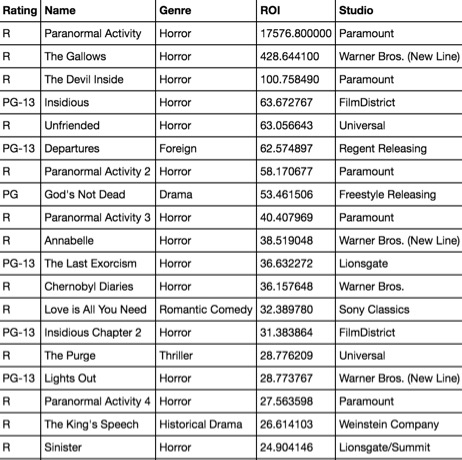
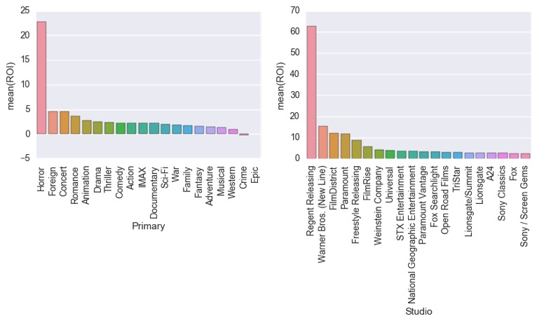
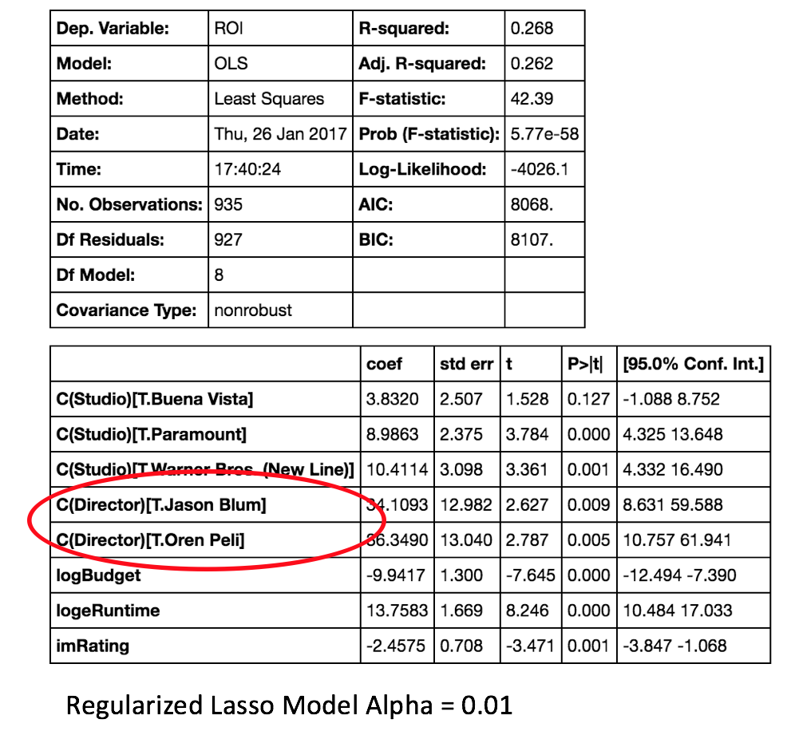
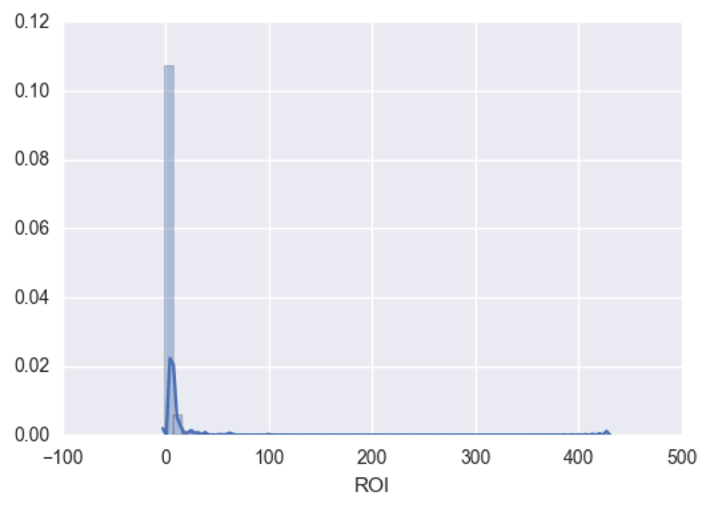
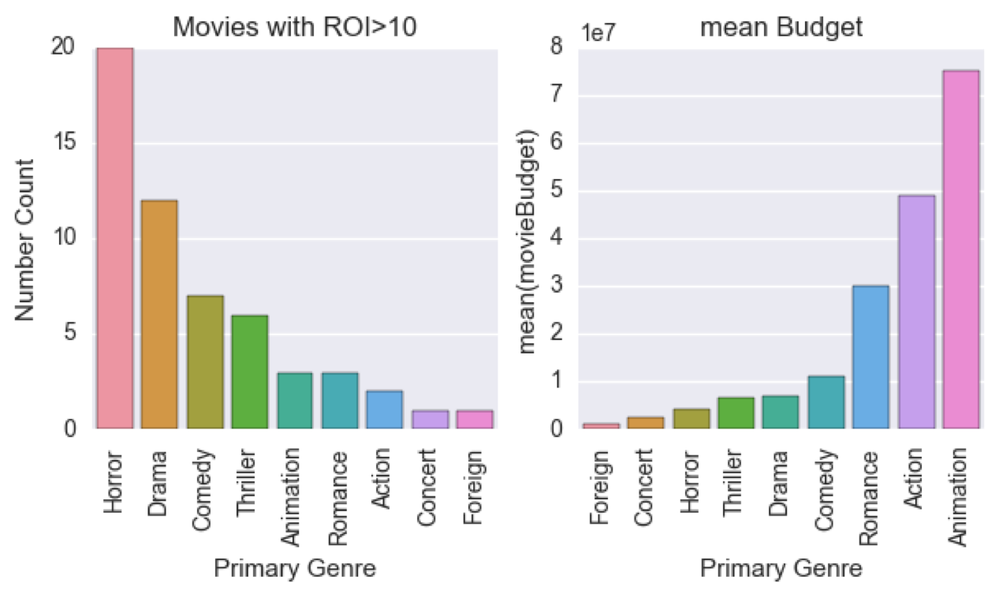
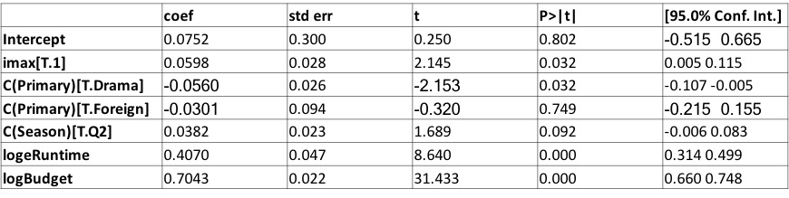

When it comes to box office dollars, people often think of those franchise movies of billions of gross box office income, such as the Avengers, Jurassic World, etc. However, are they essentially the most profitable movies? **Not necessarily!**  

   The story behind of my research is that, one day when we were building the model to predict the gross box office, a movie producer walked by and he said,   

 >'Predicting how much a movie will earn is like predicting how much a stock price will go to. That sounds very reasonable a stock rise from $100 to $110 only gives you 10% profit. So the point is how big return it is going to give you. '   

   By saying that, he gave us this very simple formula:  

> **Profit = Gross Box Office - distributor share - cinema share - budget**

This suddenly makes a lot of sense. Not every movie is gonna have hundreds of millions investment! The recipe for a successful movie becomes pretty simple. Basically you will want to know which type of movie has **the largest return on investment (ROI)** for the sake of clever minds behind the film.   

   In a more technical sense, I am going to build a predicative model using linear regression to predict the final ROI of a movie.  

### Dataset preparation

  The dataset was scraped from the-Numbers.com and Box office Mojo. It contains about 4000 movies between 2009 and 2016.  

  Features including:  

*Budget, Domestic Income, Oversea Income, Runtime, Time Released, Rating, IMDB score, Director, IMAX, Franchise*

### Data examination and feature selection

  

  The chart is a quick look at the Top 20 movies with the highest ROI. How surprising is that! Only 3 of them are none horror movies! Is this just a coincidence? Take a look at below graphs.

    

  So this is graph of average ROI for movies in different genre in the whole dataset. The incredibly high mean ROI was possibly skewed by the movies that we saw in previous graph. We will run a quick rough model using Statsmodel package.

  

  Who the hell is Oren Peli and Jason Blum?? It actually turns out that they are the directors of Paranormal Activity and Insidious Series separately and they only directed these movies. For the sake of building a normaizing model, we are going to remove these movies as outliers even though they make a lot of sense.

  The threshold of ROI I applied here is 10. We are only building models on movies with ROI less than 10.    
  The distribution of ROI of the dataset changed as below:

  There are some outliers lying way out of the distribution range.

     

  The new model is below:

  

  The R2 of this model is not very high but intuitively it gives us some insight. Basically Horror movies tend to be a more reasonable investment and for all movies, the more budget you invested in, the less possibility that you will earn it back, both of which made senses.

### Before we wrap up..  

Remember we excluded the movies that have ROI larger than 10 as outliers for our model. In real world cases, investors would might be even more interested in this section of data (*every 1 dollar you spent on this movie is giving you $10 net return!!)*.   
There are about 50 movies in this section. Below is a quick graph of the data:

  

 As expected, horror movies are dominating the high ROI movies. Even more interestingly.. The average of IMDB rating of these movies are fairly low.

 - If you did a little research on this, you will find that the rating tend to be very polarized on Horror movies. People are either so scared to be thrilled or not scared to be bored on horror movies.

  

  It only takes about 4 million to make a horror movie. Comparing with those high costing movies, investing in a horror movie is of much less risk!

### Addition research on Gross Box office

  Additional research on Gross Box office gives me a model as below:  

  

  Straightforward, movie Budget has the largest effect on a movie's outcome.

## Conclusion

Apparently, for a regular movie, how much it will earn in the end of the day basically depends on the budget the studio is going to spend. However, what if you are a student from movie school or you are just a director from an independent movie studio? You will not have not much of money to invest on your movies. So, a good suggestion to these people would be "**It's time to consider making a horror movie!**"

  The link to the project was below:

  Github link:
